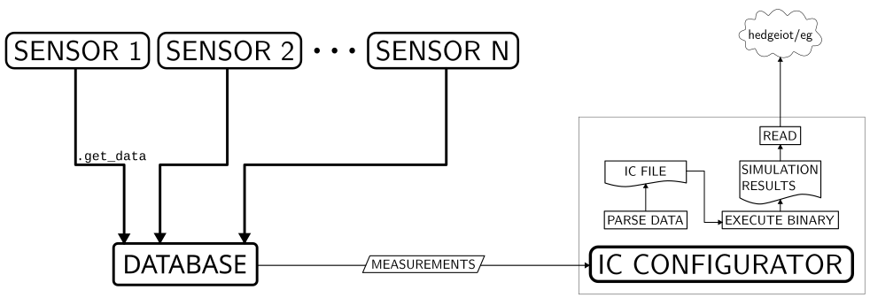

# Introduction

The aim of this software is to combine sensor data and dynamic thermal rating (DTR) software and thereby provide predictions locally. The requirements are:
- collection of data from sensors,
- computation of ampacity/loadability (and time to overheat) every minute and forwarding of the results over the web,
- robustness to device restart.

Since the collection of data shouldn't influence when predictions are computed, this software is divided in two main parts - data collection and computation of predictions. 

Due to the relatively fast execution of DTR code, low computational intensity of data collection and processing prior and post prediction computation, Python was chosen as the language due to its simplicity.

# Code structure

The code is mainly split in two parts in terms of data collection and processing, but another notable split is also in terms of which prediction software is used - either Dythera or Trafoflex. There are many common points for both, so the amount of code can be reduced with generalisation.

The basic data flow for the program is shown in the figure below. Features of this flowchart will be explained in detail in the following text.


## Project structure

Below is the project structure in the form of bullet points for easier reference starting from `hedge-iot/IotMaxxGW/device_io` of the full repo:
- `bin/` - Dythrea and Trafoflex binary executables and their `.so` dependencies
- `certificate/` contains credentials and certificates required for MQTT communication to work.  
    - `operato-mqttca.crt` MQTT certificate  
    - `credentials.xml` XML file with MQTT user credentials and parameters
		```xml  
		<data  
		username="<mqtt username>"
		password="<mqtt password>"
		broker="<mqtt broker>"
		port="<communication port>">
		</data>  
		```
        - `config/` - Contains `env.conf` that can be `source`-d and contains variables that might change between installation devices
- `data/` - Files used to help in development such as an example of an MC device message  
- `models/` - Trafoflex transformer models in binary `.pb` format
- `scripts/` - Shell/bash scripts used either for convenience or installation  
- `service/` - Shell scripts associated with systemd services
- `src/` - Main project code  
    - `device_io/` - Parent module of the package
        - `dythera/` - Module concerned with running line ampacity computations  
            - `config.py` - Constants used in the `dythera` submodule  
            - `generate_proto.py` - Functions that configure Dythera protobuffer `SimulationRequest`
            - `ic_script.py` - Called to combine data, run Dythera and communicates the results
            - `io.py` - Main code of the submodule with abstract class specialization for Dythera  
            - `main.py` - Runs the Dythrea database  
            - `pb2.py` - Protobuf-generated code for protobuffer data classes  
        - `trafoflex/` Module concerning transformer loadability computations  
	        - ... Same as in `dythera/`, but specific to Trafoflex ...  
        - `io.py` Functionality common to both Dythera and Trafoflex modules  
        - `config.py` Main constants of the package
- `tests/` - Tests for the code from `src/`  
- `venv/` - Automatically generated Python virtual environment code
- `install.sh` - Installation script called on the client machine's side
- `pyproject.toml` - `device_io` package configuration

## Data collection

The basics of data collection consist of 
- sensors that produce measurements,
- measurements that belong to a sensor type,
- database that measurements are written to and can be retrieved from it.

### Sensors

Since both DTR softwares need sensors and measurements, there exist abstract classes `Sensor` and `SensorMeasurement`. The two main methods of the `Sensor` are `get_data` that returns the `SensorMeasurement` associated with it and `start` which starts data collection. The idea behind the `Sensor` is that it is an intermediary between measurements and data collection as `get_data` should be implemented as non-blocking. E.g. if we get weather measurements every minute, the associated `Sensor` should always hold the latest measurement state and its `get_data` method may be called with an arbitrary frequency, but it will always return the latest known state.

`SensorMeasurement` generalises the concept of measurements. The main methods of this class are `parse` that accepts a string and sets the `SensorMeasurement`'s state and `to_jsonstr` that is its inverse.

The children of the `Sensor` and `SensorMeasurement` classes then implement these methods. `Sensor` possibly stores an internal state in the form of `SensorMeasurement` if it isn't immediately measurable when `get_data` is called.

All measurement times are stored in seconds since epoch.

#### Sensor types

Currently there are three sensor types where each collects data in a different way.
##### Temperature

The physical sensor is a temperature probe. Temperature is obtained by reading the a value from a file as an integer, so to get an actual temperature we just divide the read value by 1000. Its reading can be considered instantaneous.
##### MC device

Measures current to the transformer. Can be obtained either over MQTT (see [Result upload](#result-upload) for specifics of MQTT) or over the network where the MC device sends data to a specific port. The data is stored in an XML format shown below.
```xml
<data logId="033310006" app="ML" storeType="measurement" dataProvider="xml001"  
controlUnit="MC033115" deviceType="MC750A Recorder " part="A" datetimeUTC="2022-04-25  20:52:06" dst="60" tzone=" 60" tInterval="001">  
<value ident="U1  " unit="V ">233.18</value>  
<value ident="U2  " unit="V ">94.08</value>  
<value ident="U3  " unit="V ">94.13</value>  
<value ident="I1  " unit="A ">0.0000</value>  
<value ident="I2  " unit="A ">0.0000</value>  
<value ident="I3  " unit="A ">0.0000</value>  
<value ident="P1  " unit="W ">0.0</value>  
<value ident="P2  " unit="W ">0.0</value>  
<value ident="P3  " unit="W ">0.0</value>  
<value ident="Q1  " unit="var ">0.0</value>  
<value ident="Q2  " unit="var ">0.0</value>  
<value ident="Q3  " unit="var ">0.0</value>  
<value ident="E1  " unit="Wh  ">8e+04</value>  
<value ident="E2  " unit="Wh  ">18e+04</value>  
<value ident="E3  " unit="varh">0e+04</value>  
<value ident="E4  " unit="varh">3e+04</value>  
</data>
```
`McSensor` runs the data listener in a separate thread and also stores a `McSensorMeasurement` as the latest state. When a new value is received, the state is written to. Thread locks are used to prevent concurrent reading and writing.
###### MQTT

Currently the MQTT topic sends data from all transformers, so the `controlUnit` attribute of the appropriate MC device has to be specified in the configuration file.
###### Local network

The more intuitive (offline) method through is implemented using network sockets. There are multiple message versions, marked by a different `part` attribute value in the `data` element, but only `A` is relevant.
The device will requires acknowledgement of message reception for every message before sending a more recent measurement. So if it stays up while the device is down, we can still have an improved thermalisation simulation by first collecting all measurements that were made while the device was offline. The MC device is very sensitive to the format of the response so see the code if you really need to see what the format is.
##### Weather

###### MQTT

Weather data is obtained through MQTT and like the MC data, the `WeatherStationMqtt` stores the latest state in its 
internal message protected by read/write locks. The class specifies which MQTT message variables are relevant. In 
case either of the variables is missing/null in the message, the whole message is dumped.

###### RS485

A physical weather station can be connected to the device over the RS485 serial port. This functionality is 
implemented in the `WeatherStationLocal` interface

### Database

The sensors should store their results in a common database. For this reason SQLite was chosen as it permits a single writer and multiple parallel readers (although there will only be one parallel reader in our case). The basic schema of the database looks like this:
```sql
CREATE TABLE IF NOT EXISTS sensor1 (  
    timestamp PRIMARY KEY,   
    data TEXT NOT NULL);  

CREATE TABLE IF NOT EXISTS sensor2 (  
    timestamp PRIMARY KEY,   
    data TEXT NOT NULL);  

  .
  .
  .

CREATE TABLE IF NOT EXISTS sensorN (  
    timestamp PRIMARY KEY,   
    data TEXT NOT NULL);  

CREATE TABLE IF NOT EXISTS metadata (  
    key TEXT PRIMARY KEY,  
    value  
);  
  
CREATE UNIQUE INDEX IF NOT EXISTS time ON  sensor1 (timestamp);  
CREATE UNIQUE INDEX IF NOT EXISTS time ON  senso2 (timestamp);  
.
.
.
CREATE UNIQUE INDEX IF NOT EXISTS time ON  sensorN (timestamp);  
  
PRAGMA journal_mode=WAL;
```
So there is a table for every measurement where the primary column is a human-readable timestamp which should allow sorting by date. 

There is an additional table which contains metadata with key - value pairs. Currently `metadata` contains:
- `journal_mode`: Indicates whether `PRAGMA journal_mode=WAL` has been set. [Write-Ahead Logging](https://sqlite.org/wal.html) permits safe concurrent reading and writing to the database.
- `last_vacuum_time` is the last time the database has been vacuumed in integer seconds since epoch. 

The code implements the `SQLiteDbReader` and its child, `SQLiteDb`, classes for reading and writing to the database, respectively as wrappers around Python's `sqlite3` library. To avoid duplicates `SQliteDb` writes the data to the database only when the timestamp of the new entry doesn't yet exist in the database.

Besides reading and writing, `SQLiteDb` also implements maintenance in the form of removal of old data and [vacuuming](https://www.sqlite.org/lang_vacuum.html). The latter is performed to release the memory occupied by the database as removal of data doesn't do that. This memory can be repurposed by the database, but then the data is fragmented, so occasional vacuuming makes sense. The maximum age of a measurement before it is deleted is specified by a `SQLiteDb.cutoff` class variable.

### Writing into the database

SQLite permits only a single writer to the database so writing to the database requires assembling multiple data streams into one. The `StateCollector` class serves this purpose as it samples sensors in parallel threads using Python's `threading` and the sampled data is put onto a `queue.Queue`. The data is collected from the latter by the main `StateCollector`'s thread and inserted into the database. Based on the number of entries into the database, `StateCollector` checks whether the database should be cleaned up.

## Running DTR software

To run DTR software, appropriate data needs to be provided to run the binaries. This comes in form of initial conditions (ICs). Both Dythera and Trafoflex accept files as binary protobuf files. Protobuf is a Google library which enables communication between different computer languages when they all use the same data structure, but its implementation differs between languages. The need for a binary form comes from compatibility issues and specific version requirements due to difficulties with cross-compilation of modern versions of protobuf.

The `bin` folder of the project contains both executables and helper libraries which need to be in the same directory. I am slightly unsure which `.so` are needed for which, but this can be found out with some simple AB testing. I am pretty sure that `libjson_parser_lib.so` is only needed by `Dythera_exe` and `libprotobuf.so` is needed by both so the only unknown is `libcompat.so`.

### Initial condition creation

The common features of IC generation are implemented in the `IcConfigurator` class. Its main roles are:
- connecting to the database,
- collecting the data from the database,
- running the binaries,
- uploading the results.

Both DTR softwares have some common presets for `SimulationRequest` parameters. For this purpose there is a `generate_proto.py` for each respective software where the `configure_request` function is defined. Currently, it takes the `SimulationRequest` as an argument and modifies it. There is also the `configure_request_base` function which sets some default parameter values for the request. The most basic form of the `configure_request` function looks like this:
```python
def configure_request(request):
	configure_request_base(request)
```
The idea is then that the user can specify further functions and adds them in the definition of the `configure_request` function, overwriting and adding to the values set by the `configure_request_base` function. Multiple overriding functions can be written in this manner, enabling modularity. Or one can simply paste the contents of the `_base` variant into the main function and modifies it however they desire.

Besides the simulation parameters DTR software also requires measurements; System conditions, relevant for computation such as weather conditions, electrical current and temperatures. Assembly of these measurements into data points, represented by a `MeasurementPoint` message in the protobuf specification, is also the part where the differences between the needs of Trafoflex and Dythera are the most significant so they will be explained individually.

To have a distinction between individual sensor's measurements represented by a `SensorMeasurement`'s child classes and the protobuffer's `MeasurementPoint` message type data points they are hereinafter referred to as "measurement" and "measurement point", respectively.

#### Dythera

Dythera is the simplest since we assume that the line's state is closely related to the current conditions of the system, therefore it only requires a single measurement point. When we prepare initial conditions for Dythera, we simply read the latest measurement for weather from the database. This is slightly more complex for Trafoflex which requires measurements from multiple sensors.

With this data we can assemble the `SimulationRequest`. Additionally we specify the start and end time for the simulation which are the current time and 5000 s from the current time, respectively (although this can be changed in `src/device_io/dythera/config.py`)

#### Trafoflex

With Trafoflex, assembly of measurements into measurement points is more complex as every measurement point only has a single time, but if we have multiple sensors it isn't very likely that any two sensor's measurements' times will coincide. What we then do is that we use each sensor's measurements to define a step function in time where each measurement is valid from the time it was measured to the time of the next future measurement closest in time. For any collection of measurements to be valid for all times we also choose that the first measurement holds for all times before it.

With this construction we get multiple separate step functions of measurements. To combine them into a single step function of measurement points we create a `MeasurementPoint` every time any of the measurement's step functions changes by combining the values of all three step functions at that time. We can then choose which `MeasurementPoint`s to add to our `SimulationRequest` by sampling the combined step function.

The first sampling is executed at the beginning of the simulation and every sampling after is done at the combined step function's jumps. Since Trafoflex stops the simulation at the last measurement, a measurement is also added at the end time of the simulation. 

In practice the implementation doesn't use the concept of step functions but rather having a list of all measurements sorted by time and iteratively updates the measurement point's state. The implementation is also robust to the case where measurement times coincide.

Beside collecting measurements, Trafoflex also requires the internal state of the transformer. This is given by the protobuf's `TransformerState` message type which is contained in the `TransfomerModel`. The latter also contains the transformer's properties which are stored in the `models/` directory. Each time Trafoflex is run the final transformer state is stored so it can be used as the initial condition for the next run.

Trafoflex can be run in two modes, depending on the availability of a previous transfomer state:
- **Thermalisation**: If there is no prior transformer state or the state is too old. 
	- If there is no previous state a default one is generated with all component temperatures set to the current ambient temperature. In case of a missing state, its time is set to $t_{now} - t_{thermalise}$ , otherwise the state's time is used.
	- The measurement points are sampled sparsely, excluding all points that are closer than some time (e.g. 15 min). This lets the code perform larger time steps as it will always compute the transfomer state at the measurement point given in the IC file.
	- Maximum prior transfomer state age, sparse sampling time difference and $t_{thermalise}$ can be set in `src/device_io/trafoflex/config.py`.
	- This mode avoids loadability computation by setting `Simulation.numerical_setup.training_mode = true`
- **Loadability computation**: Takes all measurement points and sets `Simulation.numerical_setup.training_mode = false` to compute loadability.
When the code computes loadability, it first computes thermalisation (if necessary) and then computes loadability.

### Result upload

After the results are computed, they are output in a directory specified in the `config.py` of the respective DTR 
software. The specification states that the results should be output to the `hedgeiot/eg` MQTT topic. This is done 
by implementation of the `UploadResponse` abstract class for each DTR software. These classes contain attributes 
that should be sent to the topic and contain (some of the) inputs and outputs of the computation.

The output format wasn't specified so currently the output is a flat JSON file with variable-value pairs. The output varies between Dythera and Trafoflex.

Perhaps it is worth briefly mentioning here how the code interfaces with MQTT. This is done with a wrapper for the `paho.mqtt.client` with the `MQTTClient` class which somewhat simplifies the initialisation of the underlying `paho.mqtt.client.Client` class, specific for this use case. The class is robust to MQTT failure at initialisation and repeatedly attempts to reconnect to the service.

For verification of successful upload one can either use
```bash
mosquitto_sub -h sumo.operato.eu -p 1883 -u your_user -P your_user_password --cafile certificate_directory  -t "hedgeiot/eg"
```
or a python script in `src/listen_for_upload.py`
# Services

To ensure that the code resumes after a reboot, systemd services were established. Each DTR file uses (with `prefix` either being `dythera` or `trafoflex`)
- `<prefix>_database.service` for starting the database which runs continuously
- `<prefix>_upload.service` for constructing ICs, running binaries and upload of results
- `<prefix>_upload.timer` for periodically triggering `<prefix>_upload.service`
- `hedge_file_structure.service` which reconstructs the `/tmp` folder structure required by the code after it is deleted by the reboot

It is important to note that any environment variables used in scripts run by the services should be specified **without** comments at the end of the line. E.g. this
```bash
MODEL_PATH=models/some_model.pb  # This is the model path
```
will expand the `MODEL_PATH` variable to `models/some_model.pb  # This is the model path` and not to `models/some_model.pb`! Likewise
```bash
BASE_PATH=/data/IJS/device_io
MODEL_PATH={BASE_PATH}/models/some_model.pb
```
will expand to `MODEL_PATH` to `{BASE_PATH}/models/some_model.pb`.
# Tests

The tests are far from covering all the code, but are still useful
- `test_basics.py` tests:
	- whether credentials and certificate directories exist
	- the database can be created and read from
	- if the `SensorMessage`'s `parse` and `from_jsonstr` methods are indeed bijective
- `test_dtr.py` tests
	- whether the DTR binary files exist
	- whether the Dythera produces the expected results for IEEE parameters
	- whether Trafoflex produces expected results for a typical case
- `test_network.py` tests
	- whether the weather and upload topics are reachable
	- whether the weather topic is providing data
	
# Installation

Installation has been implemented in the `install.sh` script which permits installation of either Trafoflex or Dythera. The main parameters that need to be specified for a successful installation are in the `config/env.conf` file where each variable is described. It proceeds as follows:
1. Upload the files to the remote's project root. If the directory doesn't exist, the parent directories are created.
2. Over SSH, `local_install.sh` script is executed on the device from the project root.
	1. The `env.conf` file is copied to a typical configuration directory.
	2. A Python virtual environment is created.
	3. The `device_io` package is installed. Here an internet connection is required to download the required libraries.
	4. [Tests](#tests) for the package are run.
	5. [Services](#services) (and scripts associated with them) are installed, enabled and started

## Uninstall

To simplify testing of installation, there is also the `scripts/uninstall.sh` script that reverses everything the installation script has done.

# Dependencies
Here are specified the code dependencies other than those for Python libraries specified in the `requirements.txt` file
- `rsync` or `sshpass` for upload, depending on the configuration of the `install.sh` file.
- Python 3.10.4
- `protobuf 3.12.4` (due to DTR code being compiled with this version, Python's protobuf files also need to be generated using this version for compatibility)

# Additional notes

- On MQTT failure, the sensors still work, but they will only send the latest state they received.